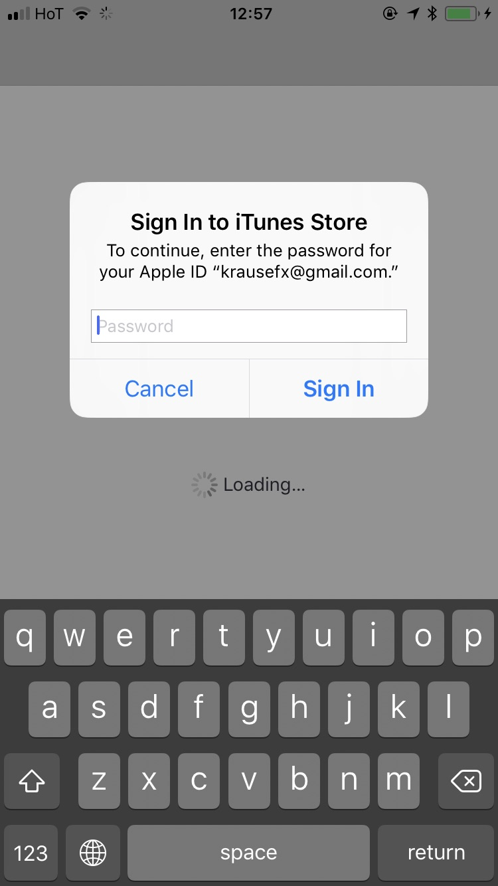
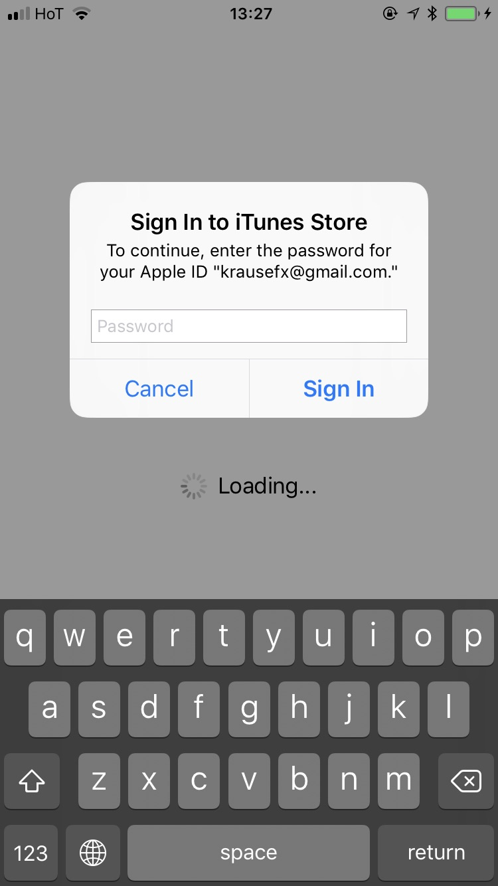
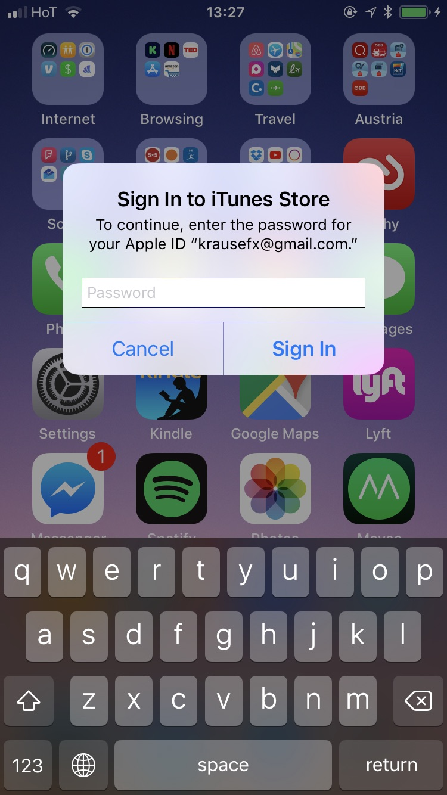
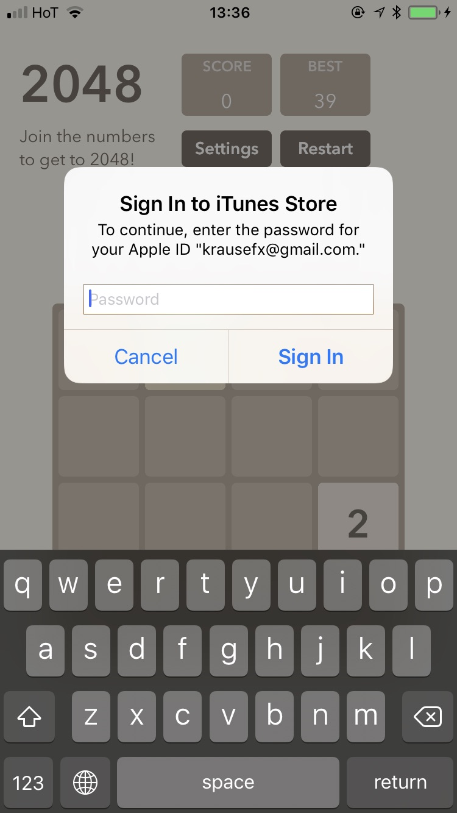
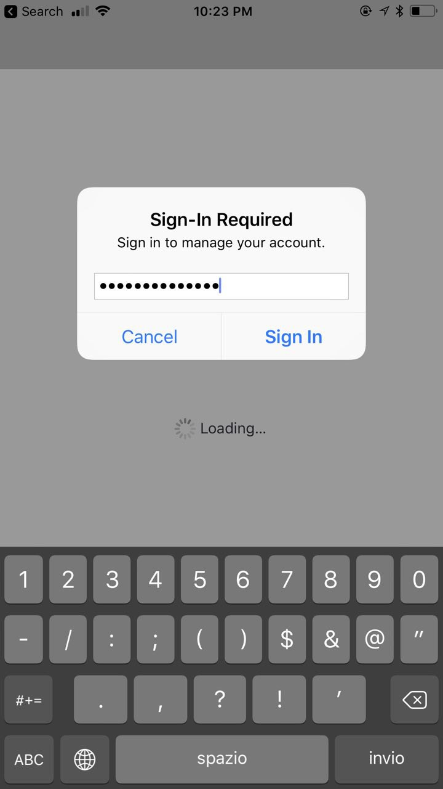
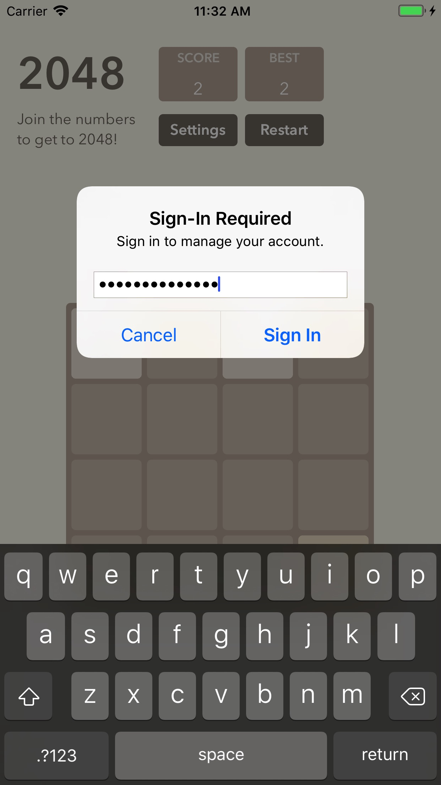
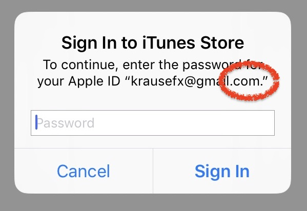

  <a href="https://github.com/krausefx/whats-the-user-doing">whats.the.user.doing</a> &bull;
  <a href="https://github.com/krausefx/detect.location">detect.location</a> &bull;
  <a href="https://github.com/KrauseFx/watch.user">watch.user</a> &bull;
  <b>steal.password</b>

-------

# `steal.password`

Do you want the user's Apple ID password, to get access to their Apple account, or to try the same email/password combination on different web services? Just ask your users politely, they'll probably just hand over their credentials, as they're trained to do so 👌

Official popup | Phishing popup
----|-----
 | 

Random system popup | Phishing popup in app/game
----|-----
 | 

## Disclaimer

`steal.password` is not intended to be used. It's a proof of concept to highlight a security loophole that can be abused by iOS apps. Apps shouldn't use this. The goal is to close this loophole and stop those Apple ID popups that appear after every iOS update, or for stuck iOS app downloads. Please don't use this anywhere!

## Why does this work?

iOS asks the user for their iTunes password for many reasons, the most common ones are recently installed iOS operating system updates, or iOS apps that are stuck during installation.

As a result, users are trained to just enter their Apple ID password whenever iOS prompts you to do so. However, those popups are not only shown on the lock screen, and the home screen, but also inside random apps, e.g. when they want to access iCloud, GameCenter or In-App-Purchases.

This could easily be abused by any app, just by showing an `UIAlertController`, that looks exactly like the system dialog.

Even users who know a lot about technology have a hard time detecting that those alerts are phishing attacks.

## How can you protect yourself

- Hit the home button, and see if the app quits:
  - If it closes the app, and with it the dialog, then this was a phishing attack
  - If the dialog and the app are still visible, then it's a system dialog. The reason for that is that the system dialogs run on a different process, and not as part of any iOS app.
- Don't enter your credentials into a popup, instead, dismiss it, and open the Settings app manually. This is the same concept, like you should never click on links on emails, but instead open the website manually
- If you hit the `Cancel` button on a dialog, the app still gets access to the content of the password field, so be careful to clear the text before dismissing a popup.

Initially I thought, faking those alerts requires the app developer to know your email. Turns out, some of those auth popups don't include the email address

Official popup without email | Phishing popup without email
----|-----
 | 

## Proposal

Modern web browsers already do an excellent job protecting users from phishing attacks. Phishing within mobile apps is a rather new concept, and therefore still pretty unexplored.

- When asking for the Apple ID from the user, instead of asking for the password directly, ask them to open the settings app
- Fix the root of the problem, users shouldn't constantly be asked for their credentials. It doesn't affect all users, but I myself had this issue for many months, until it randomly disappeared.
- Dialogs from apps could contain the app icon on the top right of the dialog, to indicate an app is asking you, and not the system. This approach is used by push notifications also, this way, an app can't just send push notifications as the iTunes app.

I've reported this as a radar, which you can dupe: [rdar://34885659](https://openradar.appspot.com/radar?id=4952345645416448) 👍

## Complexity

Showing a dialog that looks just like a system popup is super easy, there is no magic or secret code involved, it's literally the examples provided in the Apple docs, with a custom text. 

I decided not to open source the actual popup code, however, note that it's less than 30 lines of code and every iOS engineer will be able to quickly build their own phishing code.

## Q&A

Imagine if everybody read this before posting a comment on HackerNews/Reddit #oneCanDream :)

### But, I have 2-factor enabled, I'm safe, right?

Good for you, everybody should use 2-step verification obviously, however many people don't. At the same time, even if your Apple account is 2FA protected, many users still use the same username/password combination on most web services, meaning if hackers know your Apple ID password, chances are high, they're gonna try the same combination on other common services.

Also, even with 2FA enabled accounts, what if the app asked you for your 2 step code? Most users would gladly request a 2FA-token and ask for it, and directly pipe it over to a remote server.

### Apple would never accept such an app, right?

Apple is doing a great job protecting users from dangerous third party apps, that's why the App Store is built and provided like it is, that's why we code sign our application ([not really, but kind of](https://krausefx.com/blog/the-developer-part-of-ios-code-signing-doesnt-add-any-security-to-anything)).

However, it's rather easy to run certain code only after the app is approved, those are not new ideas, but just to give you some ideas:

- Use remote code (which is not allowed by itself, except for JavaScript), React Native or a custom JS bridge is your friend
- Use the iTunes search API to compare the current version number with the App Store version number ([example request](https://itunes.apple.com/lookup?bundleId=com.Facebook.Facebook)), this way the app can automatically enable malicious code after it got approved.
- Use a remote configuration tool to enable a feature only after an app is approved by Apple
- Use a time-based trigger: just skip running certain code for the first week after submitting the binary, meaning the code will only run once the app is either approved or rejected.
- [Pull an Uber and don't run certain code when the location is near Cupertino](https://www.theverge.com/2017/4/23/15399438/apple-uber-app-store-fingerprint-program-tim-cook-travis-kalanick) (it's probably fixed by Apple by now)

The things above is public knowledge, most iOS developers are aware, and I strongly advise against using any of this, Apple will eventually catch you and block your account.

The point of this list is: While the review process provides a basic safety filter, organisations with bad intent will always find a way to somehow work around the limitations of a platform.

### Phishing on mobile? Is that a thing now?

This area will become more and more relevant, with users being uninformed, and the mobile operating systems not yet clearly separating system UI and app UI. This is kind of related to [detect.location](https://github.com/KrauseFx/detect.location), where apps would write their own, custom image picker to provide a better "experience", but in reality, with that, they also get full access to your image library, and optionally also your camera (related to [watch.user](https://github.com/KrauseFx/watch.user)).

iOS should very clearly distinguish between system UI and app UI elements, so that ideally it's even obvious for the average smartphone user that something seems off. This is a tricky problem to solve, and web browser are still tackling it, you still have websites that make popups look like macOS / iOS popups, so that many users think it's a system message.

### But, but, but, why is the `.` symbol within the `"`, is this all fake? 

Nope, actually, that's how the system dialog looks like, the `.` is within the `"` string notation, so I designed the phishing dialog to also include this little, but very important design detail

## License

This project is licensed under the terms of the MIT license. See the [LICENSE](LICENSE) file.

Idea from [@tapbot_paul](https://twitter.com/tapbot_paul) via [this tweet](https://twitter.com/tapbot_paul/status/908067480568045568).

[@tapbot_paul](https://twitter.com/tapbot_paul) and I [tweeted about this issue multiple times](https://twitter.com/KrauseFx/status/908204812122165248) a while ago.

2048 app forked from [danqing/2048](https://github.com/danqing/2048) as a proof of concep on how easy it is to integrate those popups into any existing apps.

